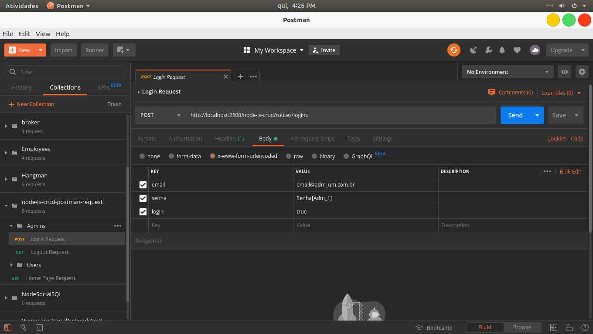

# node-js-crud
# Servidor REST para um CRUD com o Banco de Dados SQLite 3, Sequelize V5, Express, Body-Parser e Nodemon.
# Para instalar as dependências do node_modules, use o comando: npm i

# Veja o arquivo: package.json

 

# Para executar o projeto, use: npm run start

 

# Arquivo do Postman no projeto tem o nome: node-js-crud-postman.json

 

# O caminho completo para testar a url no Postman é: http://localhost:2500/node-js-crud/routes/logins

 

# Resposta do Back End para o Front End com o Postman.

 

# SQL com o dialeto do SQLite, gerado pelo Sequelize.

 

# O valor do campo login foi alterado no banco de dados SQLite.

 

# Url de cadastro: http://localhost:2500/node-js-crud/routes/users

 

# Resposta do servidor

 

# SQL insert gerado pelo Sequelize.

 

# Resposta pegar um usuário.

 

# Todos os usuários no banco de dados SQLite3.

 

# Resposta pegar todos os usuários.

 

# Resposta atualizar usuário pelo id.

 

# Resposta deletar usuário pelo id.

